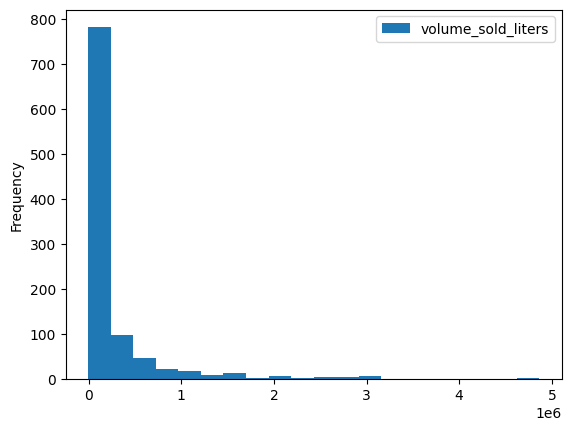
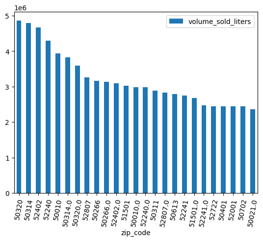
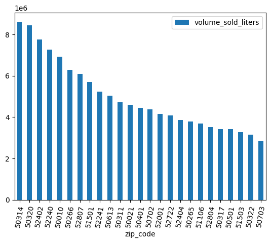
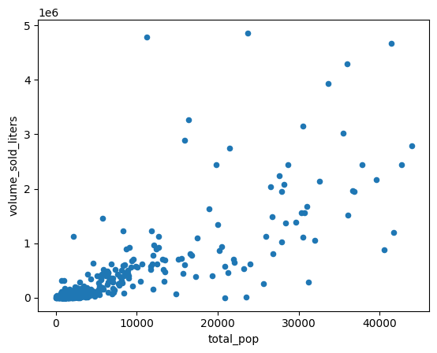
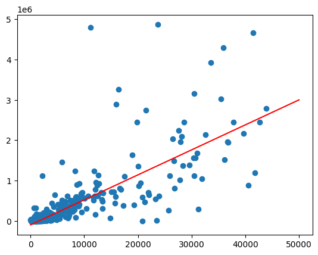
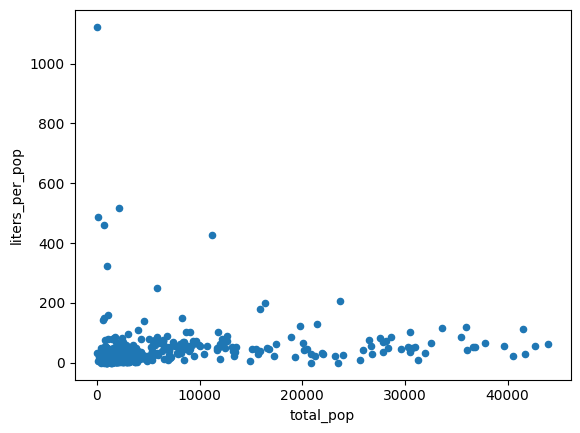
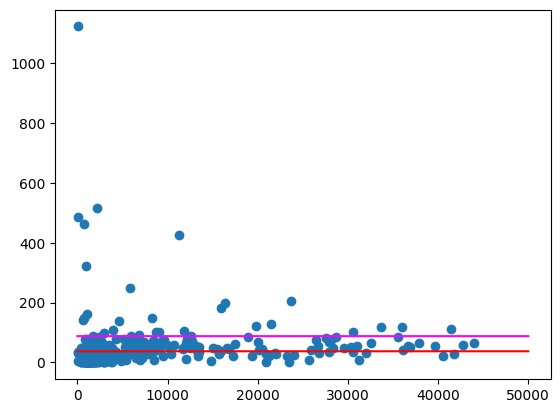
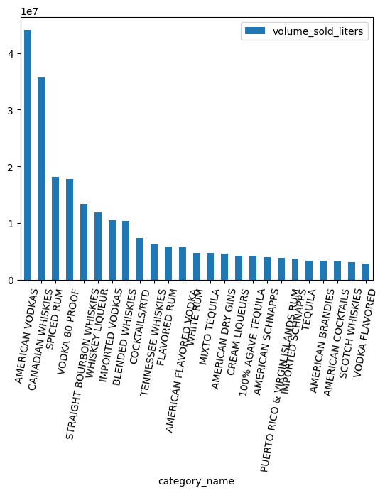
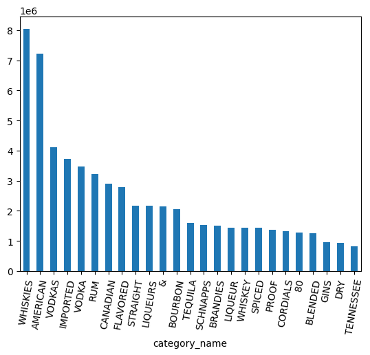
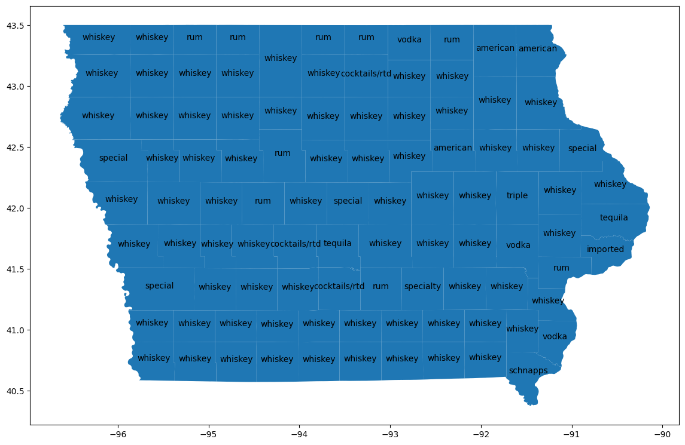

# Exploratory data analysis of Iowa liquor sales using the BigQuery DataFrames package


## Overview


In this lab, you will use BigQuery DataFrames from a Python notebook in BigQuery Studio to clean and analyze the Iowa liquor sales public dataset.
Make use of BigQuery ML and remote function capabilities to discover insights.

You will create a Python notebook to compare sales across geographic areas. This can be adapted to work on any structured data.

### Objectives

In this lab, you learn how to perform the following tasks:

* Activate and use Python notebooks in BigQuery Studio
* Connect to BigQuery using the BigQuery DataFrames package
* Create a linear regression using BigQuery ML
* Perform complex aggregations and joins using a familiar pandas-like syntax


## Requirements

* A browser, such as  [Chrome](https://www.google.com/chrome/browser/desktop/) or  [Firefox](https://www.mozilla.org/firefox/)
* A Google Cloud project with billing enabled


### Before you begin

To follow the instructions in this codelab, you'll need a Google Cloud Project with BigQuery Studio enabled and a connected billing account.

1. In the  [Google Cloud Console](https://console.cloud.google.com/), on the project selector page, select or create a Google Cloud [project](https://cloud.google.com/resource-manager/docs/creating-managing-projects)
2. Ensure that billing is enabled for your Google Cloud project. Learn how to  [check if billing is enabled on a project](https://cloud.google.com/billing/docs/how-to/verify-billing-enabled)
3. Follow the instructions to [Enable BigQuery Studio for asset management](https://cloud.google.com/bigquery/docs/enable-assets).

### Prepare BigQuery Studio

Create an empty notebook and connect it to a runtime.

1. Go to [BigQuery Studio](https://console.cloud.google.com/bigquery) in the Google Cloud Console.
2. Click the **▼** next to the **+** button.
3. Select **Python notebook**.
4. Close the template selector.
5. Select **+ Code** to create a new code cell.
6. Install the latest version of the BigQuery DataFrames package from the code cell.

   Type the following command.

   ```
   %pip install --upgrade bigframes --quiet
   ```

   Click the **🞂** button or press *Shift + Enter* to run the code cell.


## Read a public dataset

Initialize the BigQuery DataFrames package by running the following in a new code cell:

```python
import bigframes.pandas as bpd

bpd.options.bigquery.ordering_mode = "partial"
bpd.options.display.repr_mode = "deferred"
```

Note: in this tutorial, we use the experimental "partial ordering mode", which
allows for more efficient queries when used with pandas-like filtering. Some
pandas features that require a strict ordering or index may not work.

Check your `bigframes` package version with

```
bpd.__version__
```

This tutorial requires version 1.27.0 or later.

### Iowa liquor retail sales

The [Iowa liquor retail sales dataset](https://console.cloud.google.com/marketplace/product/iowa-department-of-commerce/iowa-liquor-sales)
is provided on BigQuery through [Google Cloud's public dataset program](https://cloud.google.com/datasets).
This dataset contains every wholesale purchase of liquor in the State of Iowa by retailers for sale to individuals since January 1, 2012.
Data are collected by the Alcoholic Beverages Division within the Iowa Department of Commerce.


In BigQuery, query the
[bigquery-public-data.iowa_liquor_sales.sales](https://console.cloud.google.com/bigquery?p=bigquery-public-data&d=iowa_liquor_sales&t=sales&page=table).
to analyze the Iowa liquor retail sales. Use the `bigframes.pandas.read_gbq()`
method to create a DataFrame from a query string or table ID.

Run the following in a new code cell to create a DataFrame named "df":

```
df = bpd.read_gbq_table("bigquery-public-data.iowa_liquor_sales.sales")
```


### Discover basic information about a DataFrame

Use the `DataFrame.peek()` method to download a small sample of the data.

**Run this cell:**

```
df.peek()
```

**Expected output:**

```
index	invoice_and_item_number	date	store_number	store_name	...
0	RINV-04620300080	2023-04-28	10197	SUNSHINE FOODS / HAWARDEN	
1	RINV-04864800097	2023-09-25	2621	HY-VEE FOOD STORE #3 / SIOUX CITY	
2	RINV-05057200028	2023-12-28	4255	FAREWAY STORES #058 / ORANGE CITY	
3	...				
```

Note: `head()` requires ordering and is generally less efficient than `peek()`
if you want to visualize a sample of data.

Just as with pandas, use the `DataFrame.dtypes` property to see all available
columns and their corresponding data types. These are exposed in a
pandas-compatible way.

**Run this cell:**

```
df.dtypes
```

**Expected output:**

```
invoice_and_item_number	string[pyarrow]
date	date32[day][pyarrow]
store_number	string[pyarrow]
store_name	string[pyarrow]
address	string[pyarrow]
city	string[pyarrow]
zip_code	string[pyarrow]
store_location	geometry
county_number	string[pyarrow]
county	string[pyarrow]
category	string[pyarrow]
category_name	string[pyarrow]
vendor_number	string[pyarrow]
vendor_name	string[pyarrow]
item_number	string[pyarrow]
item_description	string[pyarrow]
pack	Int64
bottle_volume_ml	Int64
state_bottle_cost	Float64
state_bottle_retail	Float64
bottles_sold	Int64
sale_dollars	Float64
volume_sold_liters	Float64
volume_sold_gallons	Float64

dtype: object
```

The `DataFrame.describe()` method queries some basic statistics from the DataFrame.
Run `DataFrame.to_pandas()` to download these summary statistics as a pandas DataFrame.

**Run this cell:**

```
df.describe("all").to_pandas()
```

**Expected output:**

```
	invoice_and_item_number	date	store_number	store_name	...
nunique	30305765	<NA>	3158	3353	...
std	<NA>	<NA>	<NA>	<NA>	...
mean	<NA>	<NA>	<NA>	<NA>	...
75%	<NA>	<NA>	<NA>	<NA>	...
25%	<NA>	<NA>	<NA>	<NA>	...
count	30305765	<NA>	30305765	30305765	...
min	<NA>	<NA>	<NA>	<NA>	...
50%	<NA>	<NA>	<NA>	<NA>	...
max	<NA>	<NA>	<NA>	<NA>	...
9 rows × 24 columns
```

## Visualize and clean the data

The Iowa liquor retail sales dataset provides fine-grained geographic information,
including where the retail stores are located. Use these data to identify trends
and differences across geographic areas.

### Visualize sales per zip code

There are several built-in visualization methods such as [DataFrame.plot.hist()](https://cloud.google.com/python/docs/reference/bigframes/latest/bigframes.operations.plotting.PlotAccessor#bigframes_operations_plotting_PlotAccessor_hist).
Use this method to compare liquor sales by ZIP code.

```
volume_by_zip = df.groupby("zip_code").agg({"volume_sold_liters": "sum"})
volume_by_zip.plot.hist(bins=20)
```

**Expected output:**



Use a bar chart to see which zip colds sold the most alcohol.

```
(
  volume_by_zip
  .sort_values("volume_sold_liters", ascending=False)
  .head(25)
  .to_pandas()
  .plot.bar(rot=80)
)
```

**Expected output:**



### Clean the data

Some ZIP codes have a trailing `.0`. Possibly somewhere in the data collection
the ZIP codes were accidentally converted into floating point values. Use
regular expressions to clean up the ZIP codes and repeat the analysis.

```
df = (
    bpd.read_gbq_table("bigquery-public-data.iowa_liquor_sales.sales")
    .assign(
        zip_code=lambda _: _["zip_code"].str.replace(".0", "")
    )
)
volume_by_zip = df.groupby("zip_code").agg({"volume_sold_liters": "sum"})
(
  volume_by_zip
  .sort_values("volume_sold_liters", ascending=False)
  .head(25)
  .to_pandas()
  .plot.bar(rot=80)
)
```

**Expected output:**



## Discover correlations in sales

Why do some zip codes sell more than others? One hypothesis is that it's due to
population size differences. A zip code with more population will likely sell
more liquor.

Test this hypothesis by calculating the correlation between population and liquor
sales volume.

### Join with other datasets

Join with a population dataset
such as the [US Census Bureau's American Community Survey](https://console.cloud.google.com/marketplace/product/united-states-census-bureau/acs) ZIP code tabulation area survey.

```
census_acs = bpd.read_gbq_table("bigquery-public-data.census_bureau_acs.zcta_2020_5yr")
```

The American Community Survey identifies states by GEOID. In the case of ZIP code
tabulation areas, the GEOID equals the ZIP code.

```
volume_by_pop = volume_by_zip.join(
    census_acs.set_index("geo_id")
)
```

Create a scatter plot to compare ZIP code tabulation area populations with
liters of alcohol sold.

```
(
    volume_by_pop[["volume_sold_liters", "total_pop"]]
    .to_pandas()
    .plot.scatter(x="total_pop", y="volume_sold_liters")
)
```

**Expected output:**



### Calculate correlations

The trend looks roughly linear. Fit a linear regression model to this to check
how well population can predict liquor sales.

```
from bigframes.ml.linear_model import LinearRegression

feature_columns = volume_by_pop[["total_pop"]]
label_columns = volume_by_pop[["volume_sold_liters"]]

# Create the linear model
model = LinearRegression()
model.fit(feature_columns, label_columns)
```

Check how good the fit is by using the `score` method.

```
model.score(feature_columns, label_columns).to_pandas()
```

**Expected output:**

```
	mean_absolute_error	mean_squared_error	mean_squared_log_error	median_absolute_error	r2_score	explained_variance
0	245065.664095	224398167097.364288	5.595021	178196.31289	0.380096	0.380096
```

Draw the best fit line but calling the `predict` function on a range of population
values.

```
import matplotlib.pyplot as pyplot
import numpy as np
import pandas as pd

line = pd.Series(np.arange(0, 50_000), name="total_pop")
predictions = model.predict(line).to_pandas()

zips = volume_by_pop[["volume_sold_liters", "total_pop"]].to_pandas()
pyplot.scatter(zips["total_pop"], zips["volume_sold_liters"])
pyplot.plot(
  line,
  predictions.sort_values("total_pop")["predicted_volume_sold_liters"],
  marker=None,
  color="red",
)
```

**Expected output:**




### Addressing heteroscedasticity

The data in the previous chart appears to be heteroscedastic. The variance around
the best fit line grows with the population.

Perhaps the amount of alcohol purchased per person is relatively constant.

```
volume_per_pop = (
    volume_by_pop[volume_by_pop['total_pop'] > 0]
    .assign(liters_per_pop=lambda df: df["volume_sold_liters"] / df["total_pop"])
)

(
    volume_per_pop[["liters_per_pop", "total_pop"]]
    .to_pandas()
    .plot.scatter(x="total_pop", y="liters_per_pop")
)
```

**Expected output:**



Calculate the average liters of alcohol purchased in two different ways:

1. What is the average amount of alcohol purchased per person in Iowa?
2. What is the average over all zip codes of the amount of alcohol purchased per person.

In (1), it reflects how much alcohol is purchased in the whole state. In (2),
it reflects the average zip code, which won't necessarily be the same as (1)
because different zip codes have different populations.

```
df = bpd.read_gbq_table("bigquery-public-data.iowa_liquor_sales.sales")
census_state = bpd.read_gbq(
    "bigquery-public-data.census_bureau_acs.state_2020_5yr",
    index_col="geo_id",
)

volume_per_pop_statewide = (
    df['volume_sold_liters'].sum()
    / census_state["total_pop"].loc['19']
)
volume_per_pop_statewide
```

**Expected output:** `87.997`

```
average_per_zip = volume_per_pop["liters_per_pop"].mean()
average_per_zip
```

**Expected output:** `37.468`

Plot these averages, similar to above.

```
import numpy as np
import pandas as pd
from matplotlib import pyplot

line = pd.Series(np.arange(0, 50_000), name="total_pop")

zips = volume_per_pop[["liters_per_pop", "total_pop"]].to_pandas()
pyplot.scatter(zips["total_pop"], zips["liters_per_pop"])
pyplot.plot(line, np.full(line.shape, volume_per_pop_statewide), marker=None, color="magenta")
pyplot.plot(line, np.full(line.shape, average_per_zip), marker=None, color="red")
```

**Expected output:**



There are still some zip codes that are quite large outliers, especially in areas
with less population. It is left as an exercise to hypothesize why this is. For
example, it could be that some zip codes are low population but high consumption
because they contain the only liquor store in the area. If so, calculating based
the population of surrounding zip codes may even these outliers out.


## Comparing types of liquor sold

In addition to geographic data, the Iowa liquor retail sales database also
contains detailed information about the item sold. Perhaps by analyzing these,
we can reveal differences in tastes across geographic areas.

### Explore categories

Items are categorized in the database. How many categories are there?

```
import bigframes.pandas as bpd

bpd.options.bigquery.ordering_mode = "partial"
bpd.options.display.repr_mode = "deferred"

df = bpd.read_gbq_table("bigquery-public-data.iowa_liquor_sales.sales")
df.category_name.nunique()
```

**Expected output:** `103`

Which are the most popular categories by volume?

```
counts = (
    df.groupby("category_name")
    .agg({"volume_sold_liters": "sum"})
    .sort_values(["volume_sold_liters"], ascending=False)
    .to_pandas()
)
counts.head(25).plot.bar(rot=80)
```



### Working with the ARRAY data type

There are several categories each of whiskey, rum, vodka, and more. I'd like to
group these together somehow.

Start by splitting the category names into separate words by using the
[Series.str.split()](https://cloud.google.com/python/docs/reference/bigframes/latest/bigframes.operations.strings.StringMethods#bigframes_operations_strings_StringMethods_split) method.
Unnest the array this creates by using the `explode()` method.

```
category_parts = df.category_name.str.split(" ").explode()
counts = (
    category_parts
    .groupby(category_parts)
    .size()
    .sort_values(ascending=False)
    .to_pandas()
)
counts.head(25).plot.bar(rot=80)
```



```
category_parts.nunique()
```

**Expected output:** `113`

Looking at the chart above, the data still have VODKA separate from VODKAS. More
grouping is needed to collapse categories into a smaller set.

## Using NLTK with BigQuery DataFrames

With only about 100 categories, it would be feasible to write some heuristics or
even manually create a mapping from category to the wider liquor type. Alternatively,
one could use a large language model such as Gemini to create such a mapping.
Try the codelab [Get insights from unstructured data using BigQuery DataFrames](/bigquery-dataframes-clustering-unstructured-data) to use BigQuery DataFrames with Gemini.

Instead, use a more traditional natural language processing package, NLTK, to
process these data. Technology called a "stemmer" can merge plural and singular
nouns into the same value, for example.

### Create a new notebook

Click the arrow in BigQuery Studio's tabbed editor and select
**Create new Python notebook**.


### Using NLTK to stem words

The [NLTK package](https://www.nltk.org/) provides natural language processing
methods that are accessible from Python. Install the package to try it out.

```
%pip install nltk
```

Next, import the package. Inspect the version. It will be used later on in the
tutorial.

```
import nltk

nltk.__version__
```

One way of standardizing words to "stem" the word. This removes any suffixes,
as a trailing "s" for plurals.

```
def stem(word: str) -> str:
    # https://www.nltk.org/howto/stem.html
    import nltk.stem.snowball

    # Avoid failure if a NULL is passed in.
    if not word:
        return word

    stemmer = nltk.stem.snowball.SnowballStemmer("english")
    return stemmer.stem(word)
```

Try this out on a few words.

```
stem("WHISKEY")
```

**Expected output:** `whiskey`

```
stem("WHISKIES")
```

**Expected output:** `whiski`

Unfortunately, this didn't map whiskies to the same as whiskey.
Stemmers don't work well with irregular plurals. Try a lemmatizer, which uses
more sophisticated techniques to identify the base word, called a "lemma".

```
def lemmatize(word: str) -> str:
    # https://stackoverflow.com/a/18400977/101923
    # https://www.nltk.org/api/nltk.stem.wordnet.html#module-nltk.stem.wordnet
    import nltk
    import nltk.stem.wordnet


    # Avoid failure if a NULL is passed in.
    if not word:
        return word

    nltk.download('wordnet')
    wnl = nltk.stem.wordnet.WordNetLemmatizer()
    return wnl.lemmatize(word.lower())
```

Try this out on a few words.

```
lemmatize("WHISKIES")
```

**Expected output:** `whisky`

```
lemmatize("WHISKY")
```

**Expected output:** `whisky`

```
lemmatize("WHISKEY")
```

**Expected output:** `whiskey`

Unfortunately, this lemmatizer doesn't map "whiskey" to the same lemma as
"whiskies". Since this word is particularly important for the Iowa retail liquor
sales database, manually map it to the American spelling by using a dictionary.

```
def lemmatize(word: str) -> str:
    # https://stackoverflow.com/a/18400977/101923
    # https://www.nltk.org/api/nltk.stem.wordnet.html#module-nltk.stem.wordnet
    import nltk
    import nltk.stem.wordnet


    # Avoid failure if a NULL is passed in.
    if not word:
        return word

    nltk.download('wordnet')
    wnl = nltk.stem.wordnet.WordNetLemmatizer()
    lemma = wnl.lemmatize(word.lower())

    table = {
        "whisky": "whiskey",  # Use the American spelling.
    }
    return table.get(lemma, lemma)
```

Try this out on a few words.

```
lemmatize("WHISKIES")
```

**Expected output:** `whiskey`

```
lemmatize("WHISKEY")
```

**Expected output:** `whiskey`

Congrats! This lemmatizer should work well for narrowing the categories. To use
it with BigQuery, you must deploy it to the cloud.

### Setup your project for function deployment

Before you deploy this to the cloud so that BigQuery can access this function,
you'll need to do some one time setup.

Create a new code cell and replace `your-project-id` with the Google Cloud project
ID you're using for this tutorial.

```
project_id = "your-project-id"
```

Create a service account without any permissions, since this function doesn't
need access to any cloud resources.

```
from google.cloud import iam_admin_v1
from google.cloud.iam_admin_v1 import types

iam_admin_client = iam_admin_v1.IAMClient()
request = types.CreateServiceAccountRequest()

request.account_id = account_id
request.name = f"projects/{project_id}"

account_id = "bigframes-no-permissions"
display_name = "bigframes remote function (no permissions)"
service_account = types.ServiceAccount()
service_account.display_name = display_name
request.service_account = service_account

account = iam_admin_client.create_service_account(request=request)
print(account.email)
```

**Expected output:** `bigframes-no-permissions@your-project-id.iam.gserviceaccount.com`

Create a BigQuery dataset to hold the function.

```
from google.cloud import bigquery

bqclient = bigquery.Client(project=project_id)
dataset = bigquery.Dataset(f"{project_id}.functions")
bqclient.create_dataset(dataset, exists_ok=True)
```

### Deploying a remote function

Now, deploy your function to the dataset you just created. Add a 
`@bpd.remote_function` decorator to the function you created in the previous
steps.

```
import bigframes.pandas as bpd


bpd.options.bigquery.ordering_mode = "partial"
bpd.options.display.repr_mode = "deferred"


@bpd.remote_function(
    dataset=f"{project_id}.functions",
    name="lemmatize",
    # TODO: Replace this with your version of nltk.
    packages=["nltk==3.9.1"],
    # Replace this with your service account email.
    cloud_function_service_account="bigframes-no-permissions@your-project-id.iam.gserviceaccount.com",
    cloud_function_ingress_settings="internal-only",
)
def lemmatize(word: str) -> str:
    # https://stackoverflow.com/a/18400977/101923
    # https://www.nltk.org/api/nltk.stem.wordnet.html#module-nltk.stem.wordnet
    import nltk
    import nltk.stem.wordnet


    # Avoid failure if a NULL is passed in.
    if not word:
        return word

    nltk.download('wordnet')
    wnl = nltk.stem.wordnet.WordNetLemmatizer()
    lemma = wnl.lemmatize(word.lower())

    table = {
        "whisky": "whiskey",  # Use the American spelling.
    }
    return table.get(lemma, lemma)
```

Deployment should take about two minutes.

### Using the remote functions

Once the deployment completes, you can switch back to your original notebook
to test this function.

```
import bigframes.pandas as bpd

bpd.options.bigquery.ordering_mode = "partial"
bpd.options.display.repr_mode = "deferred"

lemmatize = bpd.read_gbq_function("swast-scratch.functions.lemmatize")

words = bpd.Series(["whiskies", "whisky", "whiskey", "vodkas", "vodka"])
words.apply(lemmatize).to_pandas()
```

## Comparing alcohol consumption by county

Now that the `lemmatize` function is available, use it to combine categories.

### Finding the word to best summarize the category

First, create a DataFrame of all categories in the database.

```
df = bpd.read_gbq_table("bigquery-public-data.iowa_liquor_sales.sales")

categories = (
    df['category_name']
    .groupby(df['category_name'])
    .size()
    .to_frame()
    .rename(columns={"category_name": "total_orders"})
    .reset_index(drop=False)
)
categories.to_pandas()
```

Next, create a DataFrame of all words in the categories, except for a few
filler words like punctuation and "item".

```
words = (
    categories.assign(
        words=categories['category_name']
        .str.lower()
        .str.split(" ")
    )
    .assign(num_words=lambda _: _['words'].str.len())
    .explode("words")
    .rename(columns={"words": "word"})
)
words = words[
    # Remove punctuation and "item", unless it's the only word
    (words['word'].str.isalnum() & ~(words['word'].str.startswith('item')))
    | (words['num_words'] == 1)
]
words.to_pandas()
```

Note that by lemmatizing after grouping, you are reducing the load on your Cloud
Function. It is possible to apply the lemmatize function on each of the several
million rows in the database, but it would cost more than applying it after
grouping and may require quota increases.

```
lemmas = words.assign(lemma=lambda _: _["word"].apply(lemmatize))
lemmas.to_pandas()
```

Now that the words have been lemmatize, you need to select the lemma that best
summarizes the category. Since there aren't many function words in the categories,
use the heuristic that if a word appears in multiple other categories, it's
likely better as a summarizing word (e.g. whiskey).

```
lemma_counts = (
    lemmas
    .groupby("lemma", as_index=False)
    .agg({"total_orders": "sum"})
    .rename(columns={"total_orders": "total_orders_with_lemma"})
)

categories_with_lemma_counts = lemmas.merge(lemma_counts, on="lemma")

max_lemma_count = (
    categories_with_lemma_counts
    .groupby("category_name", as_index=False)
    .agg({"total_orders_with_lemma": "max"})
    .rename(columns={"total_orders_with_lemma": "max_lemma_count"})
)

categories_with_max = categories_with_lemma_counts.merge(
    max_lemma_count,
    on="category_name"
)

categories_mapping = categories_with_max[
    categories_with_max['total_orders_with_lemma'] == categories_with_max['max_lemma_count']
].groupby("category_name", as_index=False).max()
categories_mapping.to_pandas()
```

Now that there is a single lemma summarizing each category, merge this to the
original DataFrame.

```
df_with_lemma = df.merge(
    categories_mapping,
    on="category_name",
    how="left"
)
```

### Comparing counties

Compare sales in each county to see what differences there are.

```
county_lemma = (
    df_with_lemma
    .groupby(["county", "lemma"])
    .agg({"volume_sold_liters": "sum"})
    # Cast to an integer for more deterministic equality comparisons.
    .assign(volume_sold_int64=lambda _: _['volume_sold_liters'].astype("Int64"))
)
```

Find the most sold product (lemma) in each county.

```
county_max = (
    county_lemma
    .reset_index(drop=False)
    .groupby("county")
    .agg({"volume_sold_int64": "max"})
)

county_max_lemma = county_lemma[
    county_lemma["volume_sold_int64"] == county_max["volume_sold_int64"]
]

county_max_lemma.to_pandas()
```

How different are the counties from each other?

```
county_max_lemma.groupby("lemma").size().to_pandas()
```

In most counties, whiskey is the most popular product by volume, with vodka most
popular in 15 counties. Compare this to the most popular liquor types statewide.

```
total_liters = (
    df_with_lemma
    .groupby("lemma")
    .agg({"volume_sold_liters": "sum"})
    .sort_values("volume_sold_liters", ascending=False)
)
total_liters.to_pandas()
```

Whiskey and vodka have nearly the same volume, with vodka a bit higher than
whiskey statewide.

### Comparing proportions

What is unique about the sales in each county? What makes the county different
from the rest of the state?

Use the [Cohen's h measure](https://en.wikipedia.org/wiki/Cohen%27s_h) to find
which liquor sales volumes differ the most proportionally from what would be
expected based on the proportion of sales statewide.

```
import numpy as np

total_proportions = total_liters / total_liters.sum()
total_phi = 2 * np.arcsin(np.sqrt(total_proportions))

county_liters = df_with_lemma.groupby(["county", "lemma"]).agg({"volume_sold_liters": "sum"})
county_totals = df_with_lemma.groupby(["county"]).agg({"volume_sold_liters": "sum"})
county_proportions = county_liters / county_totals
county_phi = 2 * np.arcsin(np.sqrt(county_proportions))

cohens_h = (
    (county_phi - total_phi)
    .rename(columns={"volume_sold_liters": "cohens_h"})
    .assign(cohens_h_int=lambda _: (_['cohens_h'] * 1_000_000).astype("Int64"))
)
```

Now that the Cohen's h has been measured for each lemma, find the largest
difference from the statewide proportion in each county.

```
# Note: one might want to use the absolute value here if interested in counties
# that drink _less_ of a particular liquor than expected.
largest_per_county = cohens_h.groupby("county").agg({"cohens_h_int": "max"})
counties = cohens_h[cohens_h['cohens_h_int'] == largest_per_county["cohens_h_int"]]
counties.to_pandas()
```

### Visualizing counties

Join with
the [`bigquery-public-data.geo_us_boundaries.counties` table](https://console.cloud.google.com/bigquery?ws=!1m5!1m4!4m3!1sbigquery-public-data!2sgeo_us_boundaries!3scounties)
to get the geographic area for each county. County names are not unique across
the United States, so filter to only include counties from Iowa. The FIPS code
for Iowa is '19'.

```
counties_geo = (
    bpd.read_gbq("bigquery-public-data.geo_us_boundaries.counties")
    .assign(county=lambda _: _['county_name'].str.upper())
)
counties_plus = (
    counties
    .reset_index(drop=False)
    .merge(counties_geo[counties_geo['state_fips_code'] == '19'], on="county", how="left")
    .dropna(subset=["county_geom"])
    .to_pandas()
)
counties_plus
```

Use GeoPandas to visualize these differences on a map.

```
import geopandas

counties_plus = geopandas.GeoDataFrame(counties_plus, geometry="county_geom")

# https://stackoverflow.com/a/42214156/101923
ax = counties_plus.plot(figsize=(14, 14))
counties_plus.apply(
    lambda row: ax.annotate(
        text=row['lemma'],
        xy=row['county_geom'].centroid.coords[0],
        ha='center'
    ),
    axis=1,
)
```



## Clean up

If you have created a new Google Cloud project for this tutorial, you can [delete it](https://cloud.google.com/resource-manager/docs/creating-managing-projects#shutting_down_projects) to prevent additional charges for tables or other resources created.

Alternatively, delete the Cloud Functions, service accounts, and datasets created for this tutorial.


## Congratulations!

You have analyzed structured and unstructured data using BigQuery DataFrames.
Along the way you've explored Google Cloud's Public Datasets, Python notebooks
in BigQuery Studio, BigQuery ML, Vertex AI, and natural language to Python
features of BigQuery Studio. Fantastic job!


### Next steps

* Apply these steps to other data, such as the [USA names database](https://github.com/tswast/code-snippets/blob/main/2024/12-bigframes-usa-names/usa_names.ipynb).
* Try [generating Python code in your notebook](https://cloud.google.com/colab/docs/use-code-completion). Python notebooks in BigQuery Studio are powered by Colab Enterprise. Hint: I find asking for help generating test data to be quite useful.
* Explore the [sample notebooks for BigQuery DataFrames](https://github.com/googleapis/python-bigquery-dataframes/tree/main/notebooks) on GitHub.
* Create a [schedule to run a notebook in BigQuery Studio](https://cloud.google.com/bigquery/docs/orchestrate-notebooks).
* Deploy a [Remote Function with BigQuery DataFrames](https://cloud.google.com/bigquery/docs/samples/bigquery-dataframes-remote-function) to integrate third-party Python packages with BigQuery.
